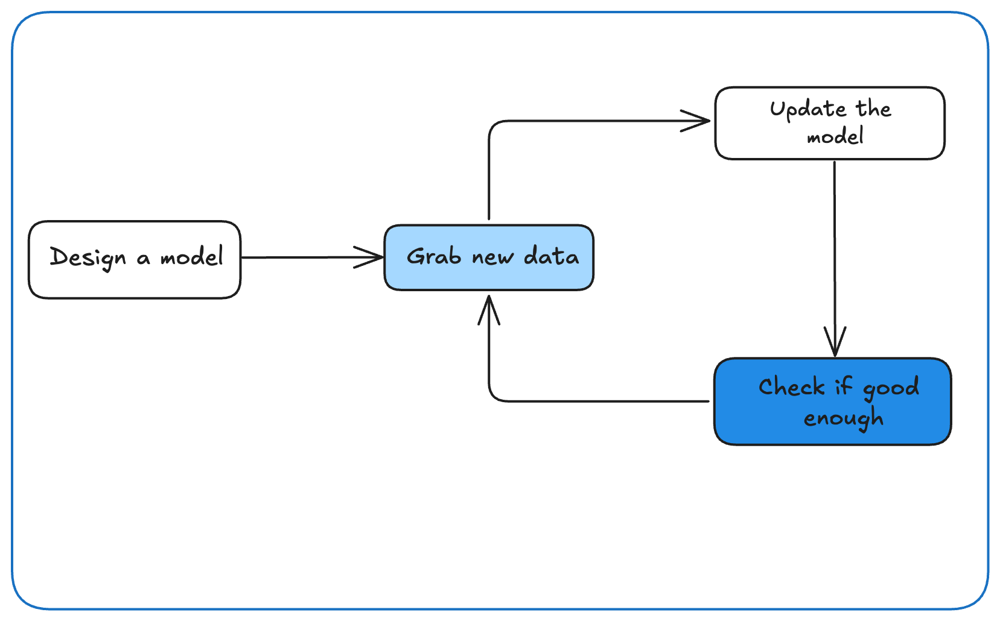
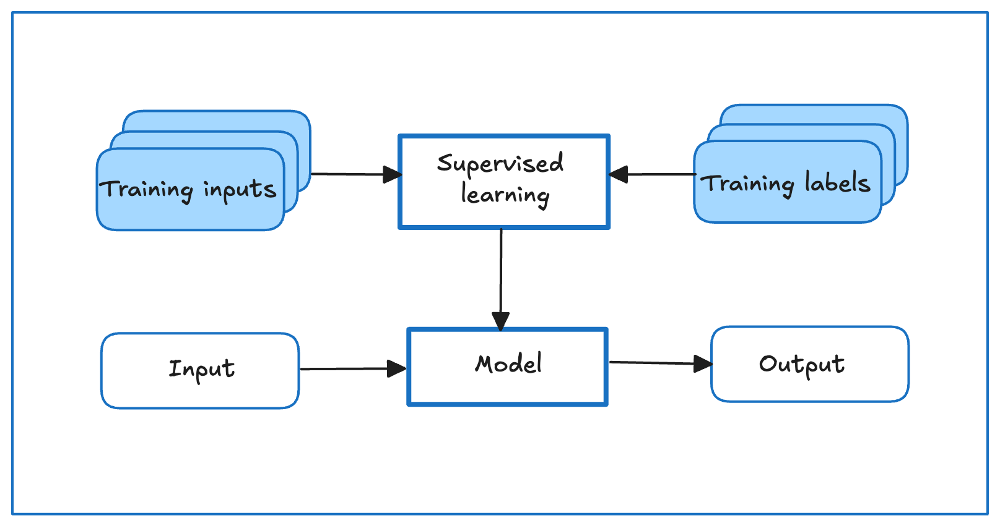
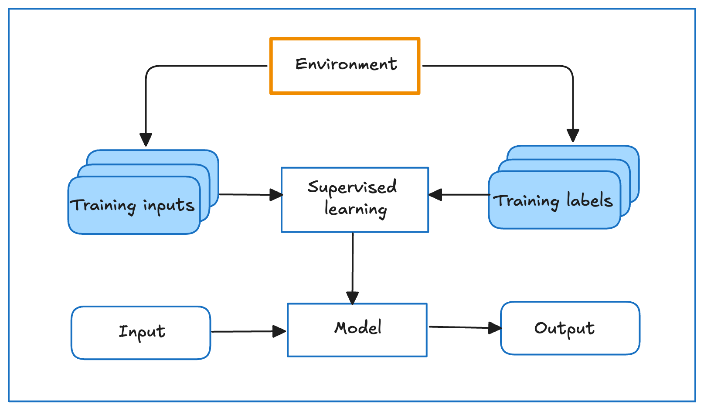
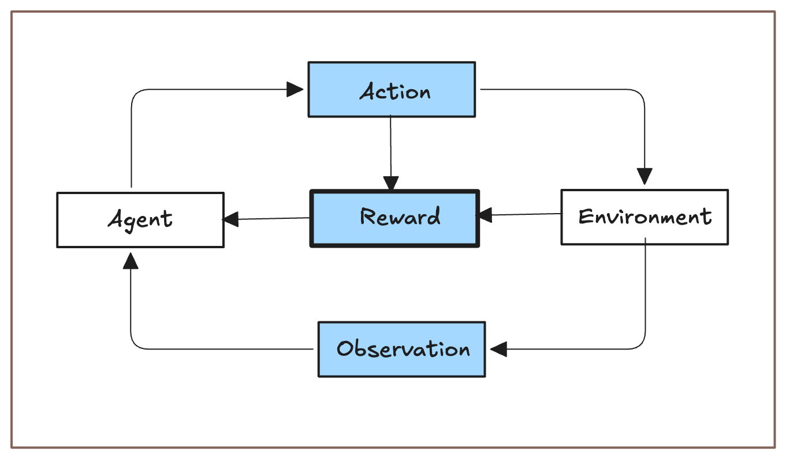

# grokking_deep_learning
This repository contains structured notes, annotated code walkthroughs, and hands-on implementations of key concepts spanning linear algebra, deep neural networks, optimization, and real-world applications, all aligned with an interactive and practical approach to learning deep learning from the ground up.


### A typical training process




- Start off with a randomly initialized model that cannot do anything useful.
- Grab some of your data (e.g., audio snippets and corresponding `{yes, no}` labels).
- Tweak the knobs to make the model perform better as assessed on those examples.
- Repeat Steps `2` and `3` until the model is awesome.


### Core components in machine learning;
- The `data` that we learn from.
- A `model` of how to transform the data.
- An `objective function` that quantifies how well (or badly) the model is doing.
- An `algorithm` to adjust the model's parameters to optimize the objective function.


## Kinds of Machine Learning Problems;

### 1. **Supervised Learning**
`Supervised learning` is a type of machine learning where the goal is to **predict a designated 
unknown label** (output) based on **known input features**, using a dataset that contains 
**example pairs of inputs and their corresponding labels**. The model learns a mapping from 
inputs to outputs by generalizing from this labeled data to make accurate predictions on unseen instances.





**a. Regression**

What makes a problem a regression is actually the form of the target. Say that you are in the market 
for a new home. You might want to estimate the fair market value of a house, given some features 
such as `square footage`, `number of bedrooms`, `number of bathrooms`, and the `transit time to downtown`. 
The data here might consist of historical home listings and the labels might be the 
observed sales prices. When labels take on arbitrary numerical values (even within some interval),
we call this a `regression problem`. The goal is to produce a model whose predictions closely 
approximate the actual label values.


Even if you have never worked with machine learning before, you have probably worked through a 
`regression` problem informally. Imagine, for example, that you had your drains repaired and that your 
contractor spent `3 hours` removing gunk from your sewage pipes. Then they sent you a bill of `350 dollars`. 
Now imagine that your friend hired the same contractor for `2 hours` and received a bill of `250 dollars`. 
If someone then asked you how much to expect on their upcoming gunk-removal invoice you might make some 
reasonable assumptions, such as more hours worked costs more dollars. You might also assume that there 
is some base charge and that the contractor then charges `per hour`. If these assumptions held true, 
then given these two data examples, you could already identify the contractor’s pricing structure: 
`100 dollars` per `hour` plus `50 dollars` to show up at your house. 
If you followed that much, then you already understand the high-level idea behind `linear regression`.


**b. Classification**

In classification, we want our model to look at features, e.g., the pixel values in an image, 
and then predict to which category (sometimes called a `class`) among some `discrete` set of options, 
an example belongs. For handwritten digits, we might have ten classes, corresponding to the digits 
0 through 9. The simplest form of classification is when there are only two classes, a problem 
which we call `binary classification`. For example, our dataset could consist of images of animals 
and our labels might be the classes `{cat, dog}`. Whereas in regression we sought a regressor to 
output a numerical value, in classification we seek a classifier, whose output is the predicted class assignment.


Given features of an example, our model assigns a probability to each possible class. 
Returning to our animal classification example where the classes are `{cat, dog}`, 
a classifier might see an image and output the probability that the image is a cat as `0.9`. 
We can interpret this number by saying that the classifier is `90%` sure that the image depicts a `cat`. 
The magnitude of the probability for the predicted class conveys a notion of uncertainty.


When we have more than two possible classes, we call the problem `multiclass classification`. 
Common examples include handwritten character recognition `{0, 1, 2, ... 9, a, b, c, ...}`. 
While we attacked regression problems by trying to minimize the `squared error loss function`, 
the common loss function for classification problems is called `cross-entropy`.


Classification can get much more complicated than just `binary` or `multiclass classification`. 
For instance, there are some variants of classification addressing hierarchically structured classes. 
In such cases not all errors are equal, if we must err, we might prefer to mis-classify to a related 
class rather than a `distant class`. Usually, this is referred to as `hierarchical classification`.


**c. Tagging**

The problem of learning to predict classes that are not mutually exclusive is called `multi-label classification`. 
Auto-tagging problems are typically best described in terms of `multi-label classification`. 
Think of the tags people might apply to posts on a technical blog, e.g., “machine learning”, 
“technology”, “gadgets”, “programming languages”, “Linux”, “cloud computing”, “AWS”. A typical 
article might have 5–10 tags applied. Typically, tags will exhibit some correlation structure. 
Posts about “cloud computing” are likely to mention “AWS” and posts about “machine learning” 
are likely to mention “GPUs”.


**d. Search**

In the field of information retrieval, we often impose ranks on sets of items. 
Take web search for example. The goal is less to determine whether a particular page is 
relevant for a query, but rather which, among a set of relevant results, should be shown most prominently to a particular user. 


**e. Recommender Systems**

Recommender systems are another problem setting that is related to search and ranking. 
The problems are similar insofar as the goal is to display a set of items relevant to the user. 
The main difference is the emphasis on `personalization` to specific users in the context of 
recommender systems. For instance, for movie recommendations, the results page for a `science 
fiction` fan and the results page for a `connoisseur of Peter Sellers comedies` might differ significantly.
Similar problems pop up in other recommendation settings, e.g., for `retail products`, `music`, and `news recommendation`.


**f. Sequence Learning**

Specifically, `sequence-to-sequence` learning considers problems where both inputs and outputs 
consist of variable-length sequences. Examples include `machine translation` and 
`speech-to-text transcription`. While it is impossible to consider all types of sequence transformations, 
the following special cases are worth mentioning.

- Tagging and Parsing: This involves annotating a text sequence with attributes. Here, the
inputs and outputs are aligned, i.e., they are of the same number and occur in a corresponding
order.


- Automatic Speech Recognition


With speech recognition, the input sequence is an audio recording of a speaker,
and the output is a transcript of what the speaker said. These are sequence-to-sequence learning problems, 
where the output is much shorter than the input. While humans are remarkably good at recognizing speech, 
even from low-quality audio, getting computers to perform the same feat is a formidable challenge.


- Text to Speech: This is the inverse of automatic speech recognition. Here, the input is text and the output is an audio file. 
In this case, the output is much longer than the input.


- Machine Translation: Unlike the case of speech recognition, where corresponding inputs and 
outputs occur in the same order, in machine translation, unaligned data poses a new challenge. 
Here the input and output sequences can have different lengths, 
and the corresponding regions of the respective sequences may appear in a different order. 


### 2. **Unsupervised and Self-Supervised Learning**

**Unsupervised learning** is a type of machine learning where the goal is to **identify patterns, structures, or groupings** 
within a dataset that contains **only input features without any designated labels**. 
Given examples with no known outputs, the model learns to **uncover hidden relationships or organize the data meaningfully**, 
such as by clustering similar instances or reducing dimensionality, without guidance from labeled outcomes.


**Here are a few questions that commonly arise in unsupervised learning:**

**a. clustering**

- Can we find a small number of prototypes that accurately summarize the data?
- Given a set of photos, can we group them into `landscape photos`, `pictures of dogs`, `babies`, `cats`, and `mountain peaks`?
- Likewise, given a collection of users’ browsing activities, can we group them into users with similar 
behavior? 


**Description:** Grouping similar data points based on patterns or distance metrics without predefined labels.

**Use Cases:**
* Customer segmentation
* Image categorization
* Document grouping

---


**b. Dimensionality Reduction**

- Which features capture the most meaningful variance or structure in the data?
- How can we reduce the number of dimensions without losing important information?

**Description:** Reducing the number of features while preserving essential structure or variance in the data.

**Use Cases:**
* Data visualization (e.g., PCA, t-SNE)
* Noise reduction
* Feature extraction for ML models

---


**c. Anomaly Detection**

- What constitutes normal behavior in the dataset?
- Which data points significantly deviate from this normal pattern and why?

**Description:** Identifying data points that deviate significantly from the majority.

**Use Cases:**
* Fraud detection
* Intrusion detection in networks
* Fault detection in systems

---


**d. Association Rule Learning**

- Which items or features frequently occur together in the dataset?
- What rules or patterns can reliably predict the presence of one item based on another?

**Description:** Discovering interesting relationships or co-occurrence patterns between variables.

**Use Cases:**
* Market basket analysis (e.g., "people who bought X also bought Y")
* Recommendation systems
* Web usage mining


**Self-supervised learning** is a type of machine learning where the model learns from unlabeled 
data by creating its own supervisory signals, typically through **pretext tasks** that involve 
predicting part of the data from other parts. It bridges the gap between supervised and 
unsupervised learning and is widely used in **representation learning**, especially in **NLP** and **computer vision**.


### 3. **Interacting with an Environment**

Unlike supervised and unsupervised learning, which rely on static, pre-collected datasets and operate 
in **offline** settings—**interacting with an environment** introduces a dynamic element where a 
learning agent **takes actions** that can **change future observations**. 
Offline learning simplifies modeling by separating learning from environmental feedback, 
but it's limited when aiming to build **intelligent agents** that act and adapt.




`fig: Collecting data for supervised learning from an environment.`


This interactive setup raises new challenges, such as:

* Whether the environment has **memory** of past actions,
* Whether it's **collaborative** (e.g., helpful users) or **adversarial** (e.g., spammers),
* Whether its behavior **changes over time**, leading to **distribution shift**—a mismatch between training and testing conditions.

These complexities are central to **reinforcement learning**, where agents must learn by 
**actively engaging with** and **adapting to** a changing environment.


### 4. **Reinforcement Learning**

If you are interested in using machine learning to develop an agent that interacts with an environment 
and takes actions, then you are probably going to wind up focusing on reinforcement learning. 
This might include applications to robotics, to dialogue systems, and even to developing 
artificial intelligence (AI) for video games. 


Reinforcement learning gives a very general statement of a problem in which an agent interacts 
with an environment over a series of time steps. At each time step, the agent receives some 
observation from the environment and must choose an action that is subsequently transmitted 
back to the environment via some mechanism (sometimes called an `actuator`), when, after each loop, 
the agent receives a reward from the environment. 


The behavior of a reinforcement learning agent is governed by a `policy`. In brief, 
a `policy` is just a function that maps from observations of the environment to actions. 
The goal of reinforcement learning is to produce good `policies`.




`fig: The interaction between reinforcement learning and an environment.`


Reinforcement learners may also have to deal with the problem of partial observability. 
That is, the current observation might not tell you everything about your current state. 
Say your cleaning robot found itself trapped in one of many identical closets in your house. 
Rescuing the robot involves inferring its precise location which might require considering 
earlier observations prior to it entering the closet.


Finally, at any given point, reinforcement learners might know of one good policy, 
but there might be many other better policies that the agent has never tried. 
The reinforcement learner must constantly choose whether to `exploit` the best (`currently`) 
known strategy as a policy, or to explore the space of strategies, potentially giving up 
some short-term reward in exchange for knowledge.


### The Essence of Deep Learning

Deep learning is the subset of machine learning concerned with models based on many-layered neural networks.
It is `deep` in precisely the sense that its models learn many `layers` of transformations.


One key advantage of deep learning is that it replaces not only the shallow models at the end of 
traditional learning pipelines, but also the labor-intensive process of feature engineering. 
Moreover, by replacing much of the domain-specific preprocessing, deep learning has eliminated 
many of the boundaries that previously separated computer vision, speech recognition, 
natural language processing, medical informatics, and other application areas, thereby 
offering a unified set of tools for tackling diverse problems.


Machine learning enables computer systems to improve at tasks using experience, often through data, 
combining ideas from statistics, data mining, and optimization. **Representation learning**, 
especially **deep learning**, automates data representation through multi-layer transformations, 
replacing traditional models and manual feature engineering. Recent advances in deep learning 
are driven by abundant data, powerful computation (e.g., GPUs), and accessible frameworks 
that simplify system optimization and boost performance.


```
poetry run python main.py
poetry run pytest
```